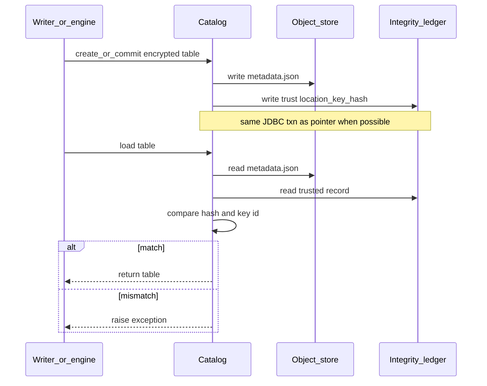

# SPIP: Governed Iceberg Table Encryption


| Field    | Value                                                                                                                                               |
| -------- | --------------------------------------------------------------------------------------------------------------------------------------------------- |
| Status   | In Review                                                                                                                                           |
| Author   | Nevin Zheng ([@nevzheng](https://github.com/nevzheng))                                                                                              |
| Shepherd | Jerry Shao ([@jerryshao](https://github.com/jerryshao))                                                                                             |
| Updated  | 2026-08-18                                                                                                                                          |
| Related  | [#914](https://github.com/datastrato/gravitino-enterprise/issues/914)                                                                               |
| Iceberg  | [Table encryption](https://iceberg.apache.org/docs/latest/encryption/) (encrypted files + [catalog security / checksums](https://iceberg.apache.org/docs/latest/encryption/#catalog-security-requirements)) |
| PRD      | [V3 Iceberg Catalog Table Encryption](https://docs.google.com/document/d/1-wk1NNXtA6e-_Y2X6RfCl08O_VrjC1U8Y6kTdPlaWiE/edit) (Mark Hoerth; internal) |


---

## Q1. What are you trying to do?

Enable Gravitino to support Iceberg v3 table encryption, with these CUJs:

- **CRUD encrypted Iceberg tables (with KMS-backed keys)** — create/load/commit/alter path works
when tables use customer KMS keys; engines do wrap/unwrap, catalog keeps encryption metadata
correct and the key binding stable.
- **Integrity** — `metadata.json` (and the encryption material it carries) can’t be silently
dropped, mangled, or swapped under the catalog.
- **Governance + auditing** — require approved keys for classified tables at create (deny or
report), and prove key-relevant decisions in the log / compliance views.

## Q2. What problem is this proposal NOT designed to solve?

- **Being a KMS** — Gravitino does not hold key material, wrap/unwrap keys, or replace the
customer’s key manager.
- **Being the thing that does encryption** — File/manifest encryption stays in the engine
(Iceberg client); the catalog does not encrypt or decrypt data.
- **Engine encryption support** — Adding or fixing encrypted-table support in engines
(e.g. Trino/Flink) is out of scope; this work assumes an engine that already can encrypt, and
focuses on catalog plumbing, integrity, and governance.

## Q3. How is it done today, and what are the limits of current practice?

Gravitino does not support Iceberg table encryption today. We are implementing the Iceberg
encryption proposal.

Tables gain optional encryption metadata (`encryption.key-id` + opaque wrapped keys in
`metadata.json`). Engines encrypt/decrypt via KMS; the catalog must round-trip that metadata.

```text
Create (encryption.key-id)
  → Engine encrypts files, wraps keys via KMS
  → Catalog writes metadata.json (opaque key bytes)
  → Load → Engine unwraps via KMS → read
```

## Q4. What is new in your approach and why do you think it will be successful?

What’s new is catalog support for Iceberg’s encryption model, scoped to the three CUJs:
round-trip encrypted table CRUD with KMS-backed keys, integrity of encryption-bearing
`metadata.json`, and create-time governance plus audit evidence.

It works because Iceberg already defines the metadata and engine crypto path; we only need the
catalog to preserve that metadata, keep the key binding stable, and enforce/prove policy at
create—without becoming the KMS or the encryptor.

## Q5. Who cares? If you are successful, what difference will it make?

Regulated customers and security orgs that need customer-controlled encryption keys, and proof
that classified tables used approved keys, not only that storage encryption exists.

Success means Gravitino can admit encrypted Iceberg tables under policy, keep that metadata
honest, and leave an audit trail. Engines still do the crypto; the catalog is where governance
and evidence live.

## Q6. What are the risks?

The change radius is medium to large. Encryption touches several catalog and client paths at once,
and failures are highly user visible (create, load, and read of encrypted tables).

The scope also needs a lot of context to understand (Iceberg encryption metadata, KMS backed keys,
policy, integrity, and audit). That makes review and rollout harder than a single isolated feature.

## Q7. How long will it take?

Best effort push to land before the 1.3 release freeze (about one week). If that does not make the
freeze, we defer to 2.0 (the more likely outcome).

Proposed milestones (order only):

1. **Encrypted CRUD**: create / load / commit / alter path works for Iceberg tables with KMS
  backed keys; key binding stays stable.
2. **Integrity**: encryption bearing `metadata.json` cannot be silently dropped, mangled, or
  swapped under the catalog.
3. **Governance + auditing**: create time approved key policy (deny or report) and audit evidence
  for key relevant decisions.

Broader PRD items (UI, federation verify, and the rest) stay outside these milestones until we
extend from this base.

## Q8. What are the mid-term and final “exams” to check for success?

Mid-term: stacked PRs land for each milestone, each with integration tests that demonstrate the
path works end to end.

Final: all three milestone suites pass on a supported engine path (Spark):

1. **Encrypted CRUD**: IT creates, loads, commits, and alters an encrypted Iceberg table with a
  KMS backed key; key binding stays stable.
2. **Integrity**: IT raises when encryption bearing `metadata.json` is dropped, mangled, or
  swapped under the catalog.
3. **Governance + auditing**: IT covers deny and report at create for non approved keys, and emits
  audit evidence for key relevant decisions.

## Appendix A. User Visible Changes

#### 1. Encrypted table CRUD

No new REST routes. Existing table APIs gain `encryption.key-id` on create/load (and keep it
stable on alter).

Correct, sensible semantics and error behavior are required; detailed design is deferred to the
design sketch and implementation.

**Illustration**

```text
POST .../tables   + encryption.key-id
GET  .../tables/{t} → encryption.key-id
PUT  .../tables/{t} → key binding stays stable
```

#### 2. Encryption policy (association scope)

Admins can require approved encryption keys for Iceberg table creates where a policy is
associated (including inherited catalog/schema/table scope), using a new built in policy type
(`system_iceberg_encryption`) as a normal (user) policy. Scope follows Gravitino’s normal
policy association / inheritance — not a tag selector in policy content.

Non compliant creates are either flagged (`report`) or rejected (`deny-create`).

Depends on the ongoing policy framework work: this SPIP requires the behavior above, not a
specific framework implementation. Shape and implementation options: **B2**.

#### 3. Integrity on load

Encrypted table load verifies that encryption-bearing `metadata.json` still matches what the
catalog last trusted. Mismatch (dropped, mangled, or swapped) raises an exception instead of
returning a silently bad table.

How trust is stored and checked: **B3**.

#### 4. Audit evidence

Key-relevant outcomes are visible in audit evidence. Ids only; never key material or KMS
credentials. Exact type names are illustrative.

1. **Governed create succeeded**: encrypted create admitted under policy

```json
{
  "type": "encryption.create.succeeded",
  "table": "metalake.catalog.schema.orders",
  "encryption.key-id": "pii-tier1",
  "policy": "pii-encryption-required",
  "enforcement": "deny-create"
}
```

1. **Policy deny**: create rejected (`deny-create`)

```json
{
  "type": "encryption.policy.denied",
  "table": "metalake.catalog.schema.orders",
  "encryption.key-id": null,
  "policy": "pii-encryption-required",
  "reason": "missing_or_not_allowed"
}
```

1. **Policy report flag**: non compliant create admitted (`report`)

```json
{
  "type": "encryption.policy.reported",
  "table": "metalake.catalog.schema.orders",
  "encryption.key-id": "dev-key",
  "policy": "pii-encryption-required",
  "reason": "missing_or_not_allowed",
  "admitted": true
}
```

1. **Key binding blocked**: alter of `encryption.key-id` rejected

```json
{
  "type": "encryption.key_binding.blocked",
  "table": "metalake.catalog.schema.orders",
  "encryption.key-id": "pii-tier1",
  "attempted": "other-key"
}
```

1. **Integrity failure**: trusted `metadata.json` hash check failed

```json
{
  "type": "encryption.integrity.failed",
  "table": "metalake.catalog.schema.orders",
  "metadataLocation": "s3://…/metadata/….json",
  "verified": false
}
```

How events are published: **B4**.

## Appendix B. Optional Design Sketch

High level implementation options for the Appendix A changes. Details settle in implementation
PRs.

### B1. Encrypted table CRUD

**Gravitino IRC API**

Primary surface for encrypted table create / load / commit / alter. Existing IRC table routes;
payloads carry Iceberg encryption fields.

```text
IRC create / load / updateTable / commit
  → admit encryption.key-id
  → preserve opaque encryption-keys across commits
  → reject quiet encryption.key-id change
```

**Gravitino native table API**

Iceberg only. Non Iceberg tables: out of scope (reject or ignore encryption props).

Sequencing: can defer behind IRC. Initial idea: route Iceberg native calls through the IRC
implementation path so behavior stays one place.

**Metadata: what we need to save**


| Need to save                                  | Meaning                                                 |
| --------------------------------------------- | ------------------------------------------------------- |
| `encryption.key-id`                           | Table master key id (immutable after create)            |
| `encryption-keys` (and related opaque fields) | Engine-produced wrapped key metadata; evolves on commit |
| format version 3                              | Required for Iceberg encryption                         |


Illustration (Iceberg `metadata.json` shape):

```json
{
  "format-version": 3,
  "properties": {
    "encryption.key-id": "pii-tier1"
  },
  "encryption-keys": [
    {
      "key-id": "generated-kek-id",
      "encrypted-key-metadata": "<opaque>",
      "encrypted-by-id": "pii-tier1"
    }
  ]
}
```

**How / where we save it (options)**

1. **Proposed for now:** extend the Iceberg metadata the catalog already keeps (inline in
  `metadata.json` as above). No parallel copy of the key id.
2. **Alternative:** introduce new Gravitino-side table(s) for encryption related state if that
  proves preferable.

Deferred: exact IRC vs native error types; trust-hash storage details (see integrity).

### B2. Encryption policy

Implements **A2**. Framework mechanics stay with the ongoing policy work; below is the
encryption-specific type shape, semantics, and options.

**Type / content shape (illustrative)**

```json
{
  "name": "pii-encryption-required",
  "policyType": "system_iceberg_encryption",
  "enabled": true,
  "content": {
    "allowedKeys": [
      { "keyId": "pii-tier1" },
      { "keyId": "pii-tier1-backup" }
    ],
    "enforcement": "deny-create"
  }
}
```

Associate the policy to a catalog, schema, or table via the normal policy association API
(same pattern as other built-ins such as `system_iceberg_compaction`). No `selector` / tag
field in content.

**Semantics**

1. **Scope:** When a create is in scope for an associated (or inherited) encryption policy,
  that Iceberg table create is subject to this policy. Creates outside that scope are
  unaffected by this policy (A1 still applies if they pass `encryption.key-id`).
2. **Requirement:** An in-scope create must present an `encryption.key-id` that appears in
  `allowedKeys`. Missing key, or a key not in the list, is **non compliant**.
3. **enforcement on non compliant create:**
  - `deny-create`: reject the create; no table. This is the steady-state rule (“disallowed key
   must not land”).
  - `report`: admit the create anyway, but record a compliance finding (audit / violations). Use
  this as a discovery and migration on-ramp so existing workflows are not hard-blocked while
  gaps are inventoried; flip the same policy to `deny-create` when ready. Default on policy
  create.
4. **Mode changes:** new creates use the current mode; existing tables are not retroactively
  encrypted by the policy.

```text
Create Iceberg table
  └─ encryption policy associated or inherited?
        no  → skip policy (A1 only)
        yes → encryption.key-id in allowedKeys?
                yes → admit
                no  → report: admit + flag
                      deny-create: reject
```

**Options to settle in implementation**


| Topic       | Options                                                                      |
| ----------- | ---------------------------------------------------------------------------- |
| Scope       | Normal policy association / inheritance (catalog → schema → table). No tags. |
| Create hook | Run the check on Iceberg table create (IRC first; native per B1 sequencing). |


Deferred: exact content JSON fields beyond `allowedKeys` / enforcement; resolver edge cases;
ambiguous multi-policy; exact HTTP mapping. Prefer concrete SPIP wording from policy owners
when available.

### B3. Integrity on load

Implements **A3**. Proposed direction matches the earlier detailed design: a **trusted metadata
record** outside object storage, checked on load.

**Backend scope**


| Backend                         | Integrity                                                                                                                                                  |
| ------------------------------- | ---------------------------------------------------------------------------------------------------------------------------------------------------------- |
| JDBC                            | **v1:** supported (opt-in). Dedicated integrity ledger.                                                                                                    |
| Hive                            | Follow-up: delegate to Iceberg/HMS integrity where available.                                                                                              |
| Standalone / REST (and similar) | **Not supported.** We cannot reliably store a trusted metadata record under our control next to the catalog pointer; we do not control that storage layer. |


**What we need to track** (trusted record)


| Field             | Role                                                                                         |
| ----------------- | -------------------------------------------------------------------------------------------- |
| catalog id        | Gravitino catalog **entity ID** (stable). Not catalog name.                                  |
| metadata location | Pointer to the current `metadata.json` tip (identifies the table for integrity)              |
| table key id      | Immutable `encryption.key-id` bound with that pointer (Iceberg opaque string, not an entity) |
| hash algorithm    | Digest name (v1: `SHA-256`)                                                                  |
| metadata hash     | Digest bytes (Hive stores Base64 of SHA-256); same algorithm as Iceberg Hive catalog         |


**Identity principle**

Do **not** use entity **names** as identifiers; they are not stable (rename / same catalog name
under different metalakes). Use Gravitino **entity ID / UUID** across the system.

**Proposed key:** `(catalog_id, metadata_location)`.

- **`catalog_id`:** catalog entity ID — globally unique and rename-stable (same idea as async
  Iceberg REST hard deletion’s `iceberg_cleanup_job.catalog_id` from
  `catalog.entity().id()`; see
  [async-iceberg-rest-hard-deletion.md](https://github.com/apache/gravitino/blob/main/design-docs/async-iceberg-rest-hard-deletion.md)).
  Metalake id is not required in the PK when catalog IDs are globally unique (Jerry’s metalake
  concern applies to **names**, not entity IDs).
- **`metadata_location`:** the live table tip we hash/verify. (Deletion instead keys the *dropped*
  table by `namespace` + `table_name` and carries `metadata_location` as purge payload — same
  `catalog_id` scope, different secondary key on purpose.)

```sql
CREATE TABLE iceberg_metadata_integrity (
  catalog_id BIGINT NOT NULL,              -- Gravitino catalog entity ID; not catalog_name
  metadata_location VARCHAR(1000) NOT NULL, -- current metadata.json tip
  table_key_id VARCHAR(2048) NOT NULL,      -- encryption.key-id (opaque Iceberg string)
  hash_algorithm VARCHAR(32) NOT NULL,      -- v1: 'SHA-256'
  metadata_hash VARCHAR(128) NOT NULL,      -- Base64(SHA-256) as in Hive, or hex equivalent
  created_at TIMESTAMP NOT NULL,
  PRIMARY KEY (catalog_id, metadata_location)
);
```

Do not expose digests on load or in audit payloads; audit may note verification failed (A4).

**Hash calculation (align with Iceberg Hive)**

Iceberg’s encryption docs define which files are encrypted vs what the catalog must protect
([Table encryption](https://iceberg.apache.org/docs/latest/encryption/)):

- **Encrypted (engine):** data, delete, manifest, and manifest-list files.
- **Not encrypted:** `metadata.json` (no data/stats).
- **Catalog integrity hash:** one digest of the current **table metadata**
  (`TableMetadata` / `metadata.json` content), kept in a separate trusted store — not a hash of
  every encrypted data file.

Checksums in a trusted store are an allowed option
([Catalog security requirements](https://iceberg.apache.org/docs/latest/encryption/#catalog-security-requirements)).
The docs do not name an algorithm. **v1 follows the Hive implementation**
([`HMSTablePropertyHelper`](https://github.com/apache/iceberg/blob/main/hive-metastore/src/main/java/org/apache/iceberg/hive/HMSTablePropertyHelper.java),
[PR #14685](https://github.com/apache/iceberg/pull/14685)):

1. Serialize current `TableMetadata` with `TableMetadataParser.toJson` (UTF-8).
2. Digest with **SHA-256** via JDK `java.security.MessageDigest` (Iceberg `HashWriter`) — no
  third-party crypto library; digest only, not encryption / key wrap (export-control note).
3. Persist the digest with the trusted catalog pointer (Hive: HMS `metadata_hash` as Base64).
4. On load, recompute and compare; mismatch → refuse the table.

```text
commit encrypted metadata
  → TableMetadata JSON (UTF-8) → MessageDigest SHA-256
  → persist digest in trusted store with catalog pointer
load
  → read metadata.json + trusted digest → recompute → match or exception
```

**Semantics**

1. **Record trust** on successful encrypted create / commit that publishes a new `metadata.json`
  (same transaction as the catalog pointer update when possible).
2. **Verify on load** before returning an encrypted table: compare location + hash (+ key id) to
  the trusted record.
3. **Match** → load proceeds. **Mismatch** → exception (exact type deferred).




**Trusted metadata schema (JDBC v1)**

Dedicated integrity ledger only (do not extend Iceberg’s own `iceberg_tables`). Identity columns
as above: **`PRIMARY KEY (catalog_id, metadata_location)`**, aligned with deletion on `catalog_id`
scope. Exact ID column type (`BIGINT` vs UUID string) follows existing Gravitino entity ID storage.

Do not mirror the hash into Gravitino `table_meta` as a second authority.

Deferred: exact exception type; opt-in flag naming; enrollment of legacy encrypted tables; Hive
backend follow-up. Optional denormalized `metalake_id` for ops/debug only — not required for
uniqueness.

### B4. Audit evidence

Implements **A4** (evidence kinds + fields stay there).

**Why this shape:** A4 is the evidence contract. Adding a brand-new listener event type /
`OperationType` is a public API change for every audit consumer. Prefer hanging A4 fields on
events that already exist.

**Propose:** extend existing table and policy listener events. Keep `OperationType.CREATE_TABLE`,
`ALTER_TABLE`, and `LOAD_TABLE` (plus existing policy lifecycle events for policy CRUD). Put
encryption facts on those events: table props where they already belong (`encryption.key-id`), and
a small extras map (for example `customInfo`) for policy name, compliance, enforcement mode, and
reason.

**Reject (default):** new `IcebergTableEncryptionAuditEvent` +
`OperationType.ICEBERG_TABLE_ENCRYPTION` (parked detailed audit doc). Last resort only if
extension cannot express A4.

**Quick sketch**

```text
A4 governed create / report (create still succeeds)
  → CreateTableEvent (SUCCESS)
  → props: encryption.key-id (when present)
  → extras: policy, compliance, enforcement=REPORT|…, reason

A4 policy deny (no table)
  → CreateTableFailureEvent (FAILURE)
  → request props + extras: compliance=VIOLATION, enforcement=DENY_CREATE, reason

A4 key binding blocked
  → AlterTableFailureEvent
  → extras: existing key id, attempted key id

A4 integrity failure
  → Load failure path
  → extras: metadataLocation, verified=false  (never raw digest)
```

Report vs deny stay on the **same** create family: success + extras vs failure + extras. That is
enough to tell them apart without a second event type.

**Pointers:** `org.apache.gravitino.listener.api.event` (`CreateTableEvent`, failure/alter/load
peers); `TableInfo.properties`; `BaseEvent.customInfo()`. Publish best-effort on the existing
EventBus (listener failure must not change the user operation result). Exact extra keys and
constructor wiring deferred to implementation PRs.

## Appendix C. Optional Rejected Designs

N/A for now.