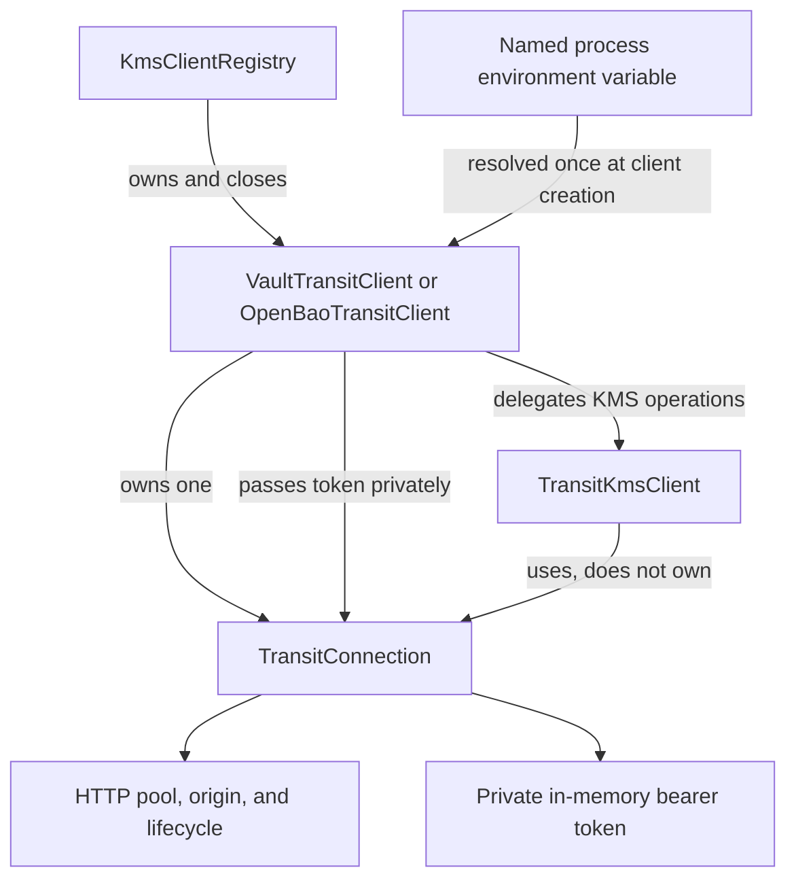
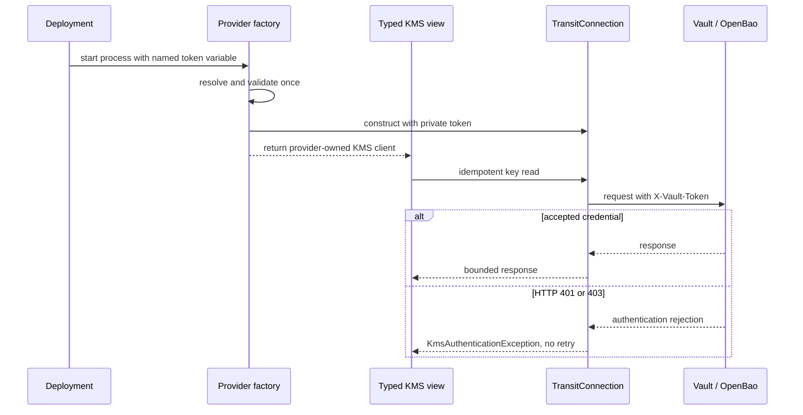
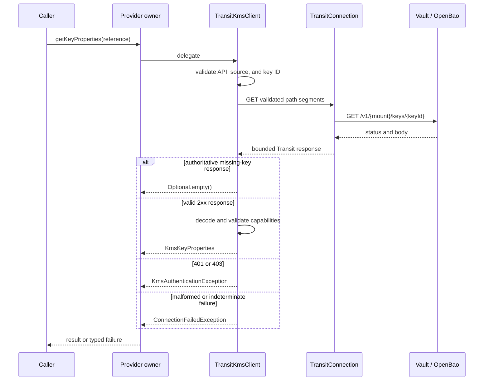
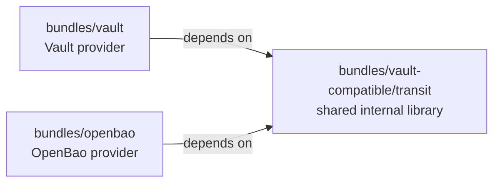
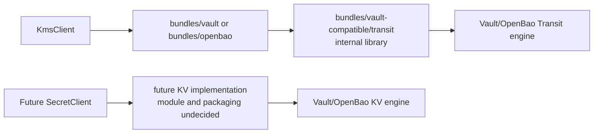

<!--
  Copyright 2026 Datastrato Inc.
-->

# Transit Client Architecture

| Field | Value |
|---|---|
| Status | Proposed |
| Author | @nevzheng |
| Created | 2026-07-30 |
| Revised | 2026-08-13 |
| Modules | `bundles/vault-compatible/transit`, `bundles/vault`, `bundles/openbao` |
| Related issue | [#1111](https://github.com/datastrato/gravitino-enterprise/issues/1111) |

## 1. Background

Vault and OpenBao expose compatible Transit APIs. Gravitino should reuse one authenticated,
thread-safe Transit connection within each configured KMS provider. Transit performs cryptographic
operations; it is not the storage engine for caller-owned secrets.

This design covers the shared Transit runtime and KMS implementation.

## 2. Goals

1. Share one authenticated, thread-safe Transit connection per configured KMS provider.
2. Keep HTTP execution, bearer credentials, and lifecycle ownership behind the typed KMS boundary.
3. Source the initial bearer credential from a named process environment variable without placing
   the credential in provider properties.
4. Make the supported credential lifecycle and its limitations explicit.
5. Deliver the design in small, independently testable Graphite changes.

## 3. Non-Goals

- Implement Secret Management or a KV client in this stack.
- Route Secret operations through `TransitConnection` or the Transit engine.
- Implement token renewal, replacement, reauthentication, or live credential reload.
- Require Vault/OpenBao Agent, Proxy, or a shared token file in this iteration.
- Share clients through a static singleton, implicit cache, or reference counting.
- Create a common HTTP base class for cloud SDK providers.

## 4. Solution Investigations

| Question | Alternatives considered | Decision |
|---|---|---|
| Provider composition | Provider inheritance or composition | Compose a provider owner with a KMS view over one Transit connection |
| Authentication | Config literal, environment token, Agent file sink, or local proxy | Resolve a named process environment variable once when the client is created |
| Transport access | Public raw HTTP escape hatch or typed internal routes | Keep raw HTTP internal |
| Delivery topology | One cloud-and-Transit stack or separate stacks | Give Transit its own stack and tracking epic |
| Provider packaging | One combined Transit artifact or one artifact per provider | Share Transit in source and package Vault and OpenBao independently |

Composition keeps provider differences explicit without coupling Vault and OpenBao through a base
class. One provider-owned Transit connection avoids duplicate pools inside the KMS client. The
credential value remains private to the provider owner and connection. The credential alternatives
and their security tradeoffs are detailed in the proposal.

## 5. Proposal

### 5.1 Architecture

The current KMS delivery uses a provider owner with a non-owning KMS view:



`KmsClientRegistry` currently owns and closes the `KmsClient` returned by a factory. Therefore the
provider owner temporarily implements `KmsClient`, delegates operations to `TransitKmsClient`, and
closes its connection. There is no `BaseTransitKmsClient`.

#### Responsibilities

| Component | Responsibility |
|---|---|
| Public KMS SPI | Provider-neutral references, results, factories, and exceptions |
| Provider factory and owner | Provider configuration, environment lookup, one connection, and current registry lifecycle |
| `TransitKmsClient` | Reference validation, key routing, status handling, and normalized properties |
| `TransitConnection` | HTTP pool, origin, private bearer token, bounded execution, and close |
| Deployment | Inject the initial token into the named process environment variable and replace the process or client when the token changes |

### 5.2 Shared connection

Typed clients provide path segments rather than absolute URLs. `TransitConnection` encodes those
segments beneath the configured `/v1/` origin and centralizes:

- HTTP(S) origin validation;
- HTTPS by default, with an explicit insecure-HTTP opt-in for isolated development and tests;
- disabled redirects and automatic HTTP retries;
- connection, pool-acquisition, and response timeouts;
- bounded connection pools and response bodies;
- private bearer-header injection without redirects or authentication retry;
- packaged logging defaults that disable Apache HTTP header and wire logging;
- idempotent close and rejection of operations after close.

KMS initially needs only idempotent GET requests. `TransitConnection` is scoped to Transit KMS.
Provider endpoints use HTTPS by default. Plaintext HTTP is rejected unless the source explicitly
sets `endpoint.allowInsecureHttp=true`; that opt-in is intended only for isolated development and
test endpoints.

### 5.3 Authentication credential

#### Terminology and boundary

The Transit bearer token authenticates Gravitino to Vault or OpenBao. It can be renewed, expire, or
be revoked. It is not a KMS key reference, key version, or generation; rotating a KMS key does not
rotate this credential, and renewing this credential does not change a KMS key.

The bearer-token value must not appear in Gravitino provider properties. Provider configuration
contains only the name of the process environment variable that holds the credential.

#### Recorded decision

| Field | Value |
|---|---|
| Recorded | 2026-08-03 |
| Scope | Initial Transit credential sourcing for this iteration |
| Decision | Resolve the bearer token from a named process environment variable |
| Rationale | Prefer one simple deployment contract while customer requirements are gathered |
| Accepted limitation | No transparent renewal, replacement, reauthentication, or live reload |
| Revisit when | Customer deployment or credential-lifecycle requirements justify another model |

The earlier design selected Agent-managed file delivery because it supports long-running renewal
and reauthentication without restarting Gravitino. This recorded decision supersedes that choice
for the current iteration. Agent auto-auth with a file sink and Vault/OpenBao Proxy remain viable
future alternatives rather than rejected designs.

#### Configuration and lifecycle contract

Each provider accepts exactly one credential method in this iteration:

```properties
credential.method=environment_variable
credential.environmentVariable=VAULT_TOKEN
```

`credential.environmentVariable` contains a variable name, not the bearer token. The deployment
injects the secret value into that variable. The provider factory validates the name, resolves the
value once when it creates the client, validates it without disclosing it, and passes it privately
to `TransitConnection`. The connection retains the token only in process memory and applies it to
the `X-Vault-Token` header.

The resolved value must be present, nonblank, single-line, and bounded in size. It must never appear
in exceptions, returned properties, or diagnostics. The packaged logging configuration disables
Apache HTTP header and wire logging so the authentication header is not emitted when general debug
logging is enabled; operators must not override those safeguards. Deployments should populate the
variable through their secret-management mechanism rather than placing the token inline in a
checked-in chart or ordinary configuration file.

Java's process environment is immutable from the application's perspective. Therefore this design
does not poll or reread the environment on each request, and it does not imply runtime rotation. A
credential change requires the deployment to recreate the client or restart the process with a new
environment. HTTP `401` or `403` fails immediately as `KmsAuthenticationException`; Gravitino does
not retry the same rejected credential.

Token renewal and reauthentication beyond initial sourcing are not defined by this decision and
must not be represented as supported. In particular, this stack does not make Gravitino a Vault or
OpenBao credential-lifecycle manager.



#### Verification

The HTTP-foundation PR must unit test invalid or missing variable names, absent values, blank,
multiline, and oversized values, credential redaction, and rejection of plaintext HTTP without an
explicit opt-in. Connection tests must verify the exact header behavior and that `401` or `403` is
not retried. Provider tests must verify that client creation resolves the named variable and that no
provider property accepts a literal token. Packaging verification must lock down the shaded Apache
HTTP header and wire logger categories. A later integration-test PR must exercise real Vault and
OpenBao requests using an injected environment variable; live token rotation is explicitly outside
this iteration.

#### References

- [Vault token concepts](https://developer.hashicorp.com/vault/docs/concepts/tokens)
- [Vault CLI environment-variable usage](https://developer.hashicorp.com/vault/docs/commands)
- [Vault Agent auto-auth](https://developer.hashicorp.com/vault/docs/agent-and-proxy/autoauth)
  and [Vault Proxy](https://developer.hashicorp.com/vault/docs/agent-and-proxy/proxy/apiproxy) as
  deferred lifecycle alternatives
- [Kubernetes Secret injection and environment update behavior](https://kubernetes.io/docs/tasks/inject-data-application/distribute-credentials-secure/)

### 5.4 KMS behavior

`TransitKmsClient` validates that a `KmsReference` belongs to its configured API and source, then
uses the key identifier to inspect the Transit key. The original reference is preserved in the
returned `KmsKeyProperties`.

Vault and OpenBao currently expose the same normalized KMS properties, so one internal Transit
properties implementation is sufficient. OpenBao's `soft_deleted=true` state is normalized as a
missing key. A provider policy should be introduced only for a real observable difference.

The implementation fails closed:

| Condition | Result |
|---|---|
| Invalid reference | `IllegalArgumentException` |
| Invalid provider configuration | `KmsConfigurationException` |
| Missing, invalid, or rejected credentials | `KmsAuthenticationException` |
| Authoritative missing key | `Optional.empty()` |
| Timeout, route error, malformed response, or unexpected status | `ConnectionFailedException` |
| Valid key response | Normalized `KmsKeyProperties` |

Only an authoritative missing-key response becomes empty. Authentication, availability, malformed
responses, and route-level `404` responses remain errors.



### 5.5 Package and module layout

The target Gradle layout separates the reusable Transit implementation from provider ownership:

```text
bundles/vault-compatible/transit
  internal Transit HTTP and typed KMS library (`:bundles:vault-compatible:transit`)

bundles/vault
  Vault provider owner, factory, tests, and service registration

bundles/openbao
  OpenBao provider owner, factory, tests, and service registration
```



`bundles/vault` and `bundles/openbao` will depend on `bundles/vault-compatible/transit`. The shared
module must contain no provider service registration and must not be installed as a standalone KMS
provider. This keeps one source implementation of the compatible Transit protocol while giving each
operator-facing provider an independent module and artifact. Nesting the library under
`vault-compatible` keeps top-level `bundles/` names product-owned.

The Vault provider implementation initially landed in `bundles/transit`. A focused follow-up moves
the same Vault composition root, factory, service registration, and tests into `bundles/vault`,
and renames the shared library path to `bundles/vault-compatible/transit`, without changing
provider behavior or configuration.

Gradle module ownership does not require a Java package rename. The Java packages remain:

```text
com.datastrato.gravitino.transit.common
  connection, authentication, response, and shared validation

com.datastrato.gravitino.transit.kms
  KMS view, key DTOs, normalized properties, and KMS factory support

com.datastrato.gravitino.transit.vault
  Vault provider owner and factory

com.datastrato.gravitino.transit.openbao
  OpenBao provider owner and factory
```

Provider-neutral SPI types remain in `org.apache.gravitino.encryption.kms`. Enterprise
implementations use `com.datastrato.gravitino`; the transitional
`com.datastrato.gravitino.kms.transit` namespace is not retained.

### 5.6 Distribution

#### Recorded packaging decision

| Field | Value |
|---|---|
| Recorded | 2026-08-07 |
| Scope | Transit KMS provider module ownership and runtime artifacts |
| Decision | Retain one internal Transit source library and distribute separate Vault and OpenBao provider artifacts |
| Rationale | Match operator-facing provider boundaries and allow either provider to be installed independently |
| Accepted tradeoff | Self-contained artifacts duplicate privately relocated runtime classes, but source code remains shared |
| Unchanged | KMS behavior, configuration, authentication, lifecycle, and failure semantics |

The distribution must build two independently installable shaded artifacts under
`distribution/package/kms-providers`: one from `bundles/vault` and one from `bundles/openbao`.
There must be no deployable `transit-kms-bundle`. Each provider artifact must contain exactly one
`KmsClientFactory` service entry and only the provider selected by its artifact name.

Each artifact must privately relocate the shared Transit implementation and its HTTP and JSON
dependencies beneath a provider-specific shaded namespace. Therefore installing both artifacts
must not expose duplicate `com.datastrato.gravitino.transit.common`,
`com.datastrato.gravitino.transit.kms`, Apache HTTP, or Jackson classes on the server classpath.
Server-provided Gravitino interfaces and logging APIs must not be bundled or relocated.

The server launcher will add `kms-providers` to its application classpath. Packaging verification
must prove all of the following:

- exactly two provider artifacts are installed;
- each artifact contains exactly its one expected factory;
- neither artifact exposes unrelocated shared Transit or third-party implementation classes;
- sensitive Apache HTTP header and wire logging is disabled for both relocated namespaces; and
- each factory loads in isolation and both factories load together in fresh JVMs over the assembled
  distribution classpath without contacting either backend.

This packaging decision does not make Transit a Secret or KV engine. The artifacts delivered by
this stack will provide Transit KMS behavior only; future Secret Management support remains an
independent design and delivery concern.

## 6. Task Breakdown

1. the original shared-client design document;
2. environment credential loading plus shared Transit connection and validation;
3. typed KMS behavior;
4. Vault provider composition;
5. this provider-packaging design revision;
6. Vault provider module relocation;
7. OpenBao provider module and composition;
8. live-provider integration tests;
9. environment-variable authentication documentation;
10. separate shaded provider artifacts and packaged-runtime coexistence discovery.

### Review sizing

Each implementation PR should aim for roughly 1,000 changed, non-generated lines or fewer. This is
a reviewability guideline, not a hard cap: every PR must still tell one coherent story, compile on
its parent, include the tests for its behavior, and leave no intentionally broken intermediate
state. If a layer is materially larger, split it at a typed capability or provider boundary rather
than separating implementation from its tests merely to meet the line target. Design documents,
generated files, and mechanical package moves are called out separately when assessing size.

The original design, shared-connection, provider-neutral KMS, and Vault composition layers are
landed. This packaging design revision begins the second review wave; the Vault module relocation,
OpenBao provider, integration-test, documentation, and packaging layers are restacked on it. All
implementation layers use JDK 17 verification.

## 7. Testing

Every implementation branch from the HTTP-foundation layer onward must pass
`./gradlew :bundles:vault-compatible:transit:check -PskipITs` with JDK 17. Provider branches additionally run the
corresponding `:bundles:vault:check` or `:bundles:openbao:check` task. The integration-test layer
runs each provider's tagged Docker tests with `-PskipDockerTests=false`. Packaging verification
checks both shaded artifacts independently and together on the assembled distribution classpath.
Each PR carries the unit tests for the behavior it introduces; both design PRs are validated for
Markdown structure, links, and whitespace.

## 8. Deferred Decisions

- A common public interface for Vault and OpenBao owners is unnecessary until a caller requires it.
- Token renewal, reauthentication, and alternative Agent, Proxy, or file-based delivery remain
  deferred until customer deployment requirements establish a lifecycle contract.

## Appendix A: Supporting KV alongside Transit

This appendix is informative and does not define KV work in the Transit KMS stack. Vault and
OpenBao use different engines for the two Gravitino capabilities:



The future provider-neutral Secret API, provider ownership, module names, and KV packaging belong
to a separate design and delivery stack. No `bundles/kv` module is selected here. A future KV
implementation owns its connection, authentication, retry semantics, and lifecycle independently
by default and must not be placed inside the internal `bundles/vault-compatible/transit` library.

### A.1 Credential independence

This Transit stack does not introduce a shared authentication module. A future KV implementation
must define its own credential source, lifecycle, policies, and failure behavior from its customer
requirements. It may use a named environment variable, Agent, Proxy, or another model independently
of Transit.

If Transit and KV later demonstrate identical credential contracts, a small provider-neutral
abstraction can be extracted from working implementations. Until then, sharing a token source would
prematurely couple two engines and imply lifecycle behavior that this decision explicitly defers.
